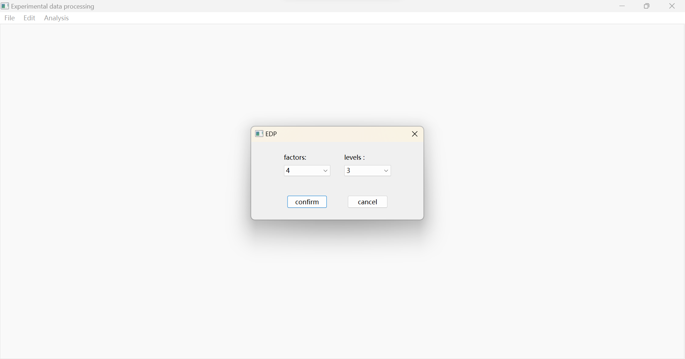
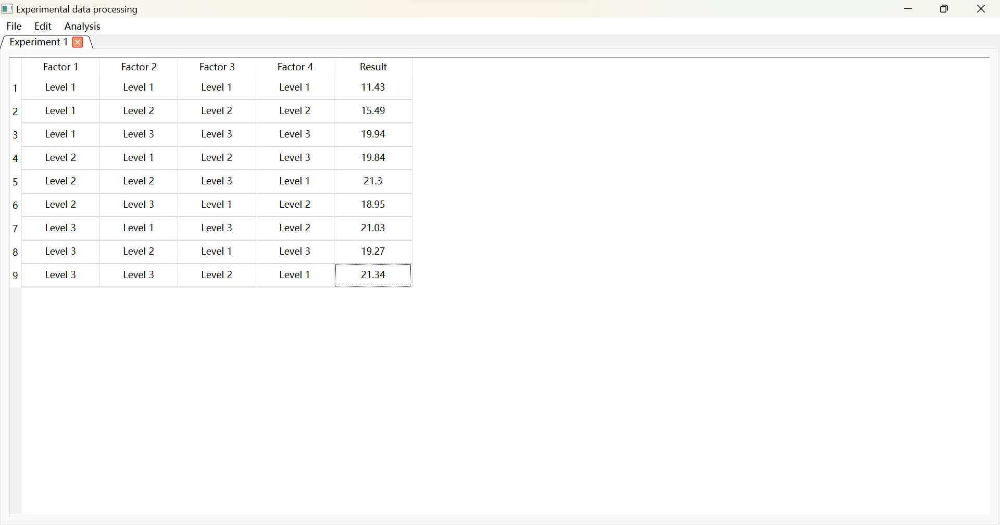
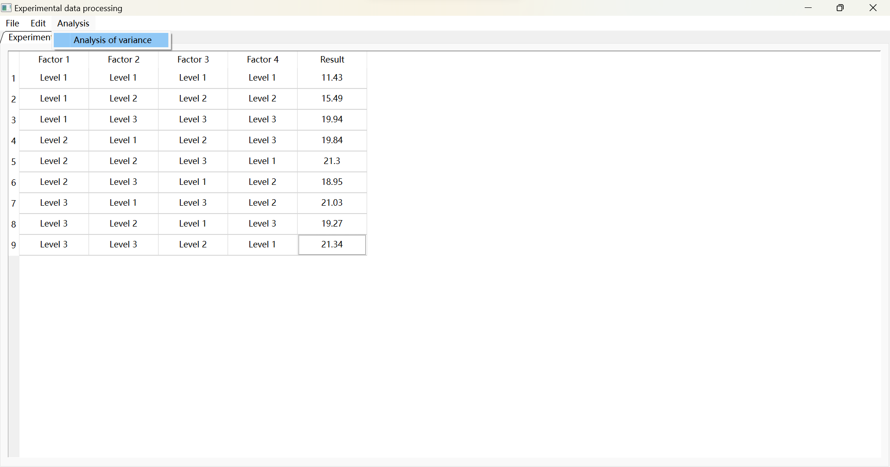
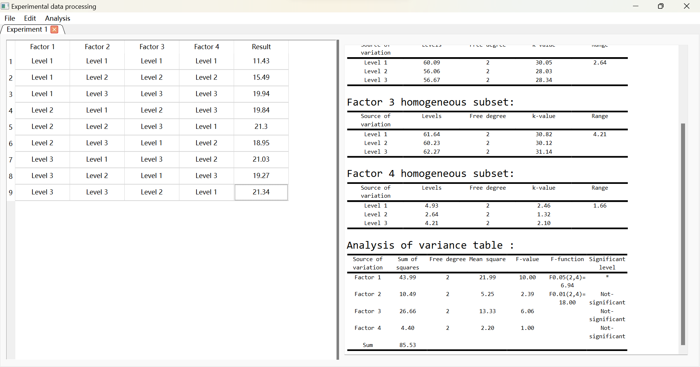

# version 1.1.1

### Update content

1. Support orthogonal experimental design. Automatically select the appropriate orthogonal table according to the number of factors and levels.
2. Support experimental data processing. Orthogonal experiment supports range analysis and variance analysis.
3. At present, there is no support for interaction between factors and the level number of factors should be consistent.

### Introduction

1. Selection number of factors and levels.Then confirm it.

   

2. Put the experimental result into the **Result** column.

   

3. Select  **Analysis** menu,then select **analysis of variance**.

   

4. Waiting for results.

   

# version 1.1.2

### Update content

1. Supports uniform experimental design. Automatically select appropriate uniform tables based on the number of factors and levels.
2. Support experimental data processing. Uniform experiment supports Multiple linear regression which using gradient descent algorithm to achieve.
3. The next version will support non-linear regression.